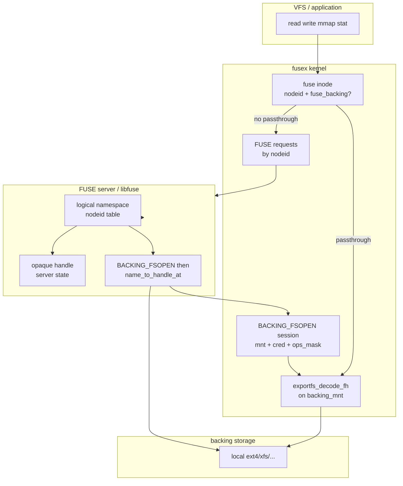
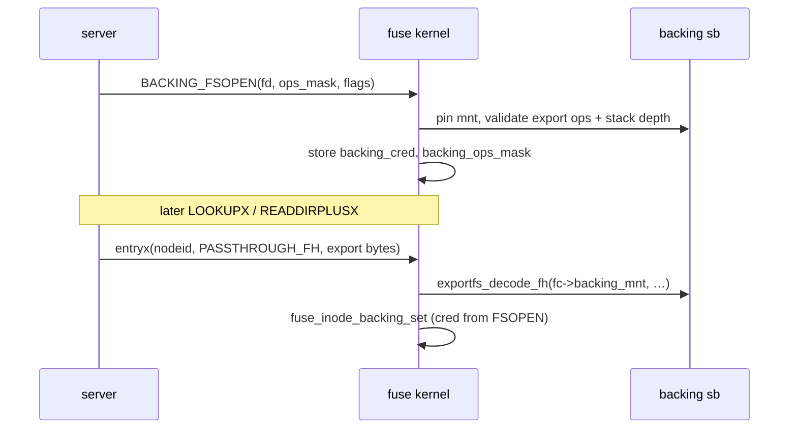
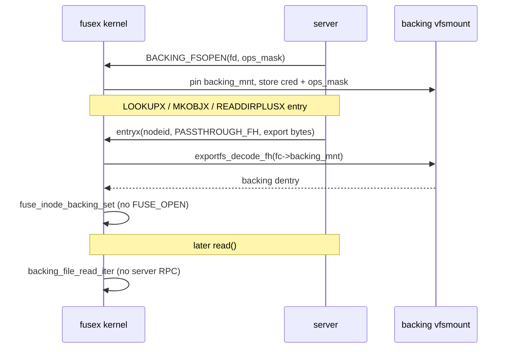

# FUSEX passthrough design (general)

Design for how passthrough fits into fusex: identity delivery, file handles,
kernel vs server resolution, and the unified LOOKUPX / READDIRPLUSX model.

Related: [fusex RFC](https://lore.kernel.org/linux-fsdevel/20260429102058.1362965-1-mszeredi@redhat.com/),
[kernel passthrough doc](https://github.com/torvalds/linux/blob/master/Documentation/filesystems/fuse/fuse-passthrough.rst),
`fusex-readdirplus-design.md`.

---

## Problem statement

Classic FUSE passthrough wires the data path at **OPEN** time:

1. Server opens backing file, registers fd via `FUSE_DEV_IOC_BACKING_OPEN`
2. Kernel returns `backing_id`
3. Server replies to `FUSE_OPEN` with `FOPEN_PASSTHROUGH` + `backing_id`
4. Kernel maps `backing_id` → `struct fuse_backing` → `backing_file_*` I/O

This model breaks down for fusex because:

- **No-open** is mandatory for regular files — there is no OPEN handshake
- **LOOKUPX / READDIRPLUSX** deliver identity separately from attrs — passthrough
must attach to identity, not open
- **backing_id** forces server state (open fds or idr slots) and `CAP_SYS_ADMIN`
for per-file `BACKING_OPEN` registration
- **Per-inode registration** (`BACKING_ADD` by nodeid) duplicates server state
and races with concurrent opens unless carefully ordered
- **Server-resolved backends** have no kernel-visible backing dentry —
passthrough must generalize beyond “local fd registration”

The general fusex principle:

> **Identity ops** (LOOKUPX, MKOBJX, READDIRPLUSX) establish *what* the object is
> and optionally *how the kernel can reach backing storage for I/O*.
> **Metadata ops** (STATX, SETSTATX, xattr, …) go to the server by nodeid (+ opaque
> handle if needed). **Data ops** use kernel passthrough when the entry advertises a
> kernel-decodable backing handle; otherwise they stay on the FUSE wire.

---


## Architectural layers




### Backing session: `BACKING_FSOPEN`

Kernel-resolved passthrough (Mode A) is confined to **one backing superblock**
per fuse connection. A single privileged ioctl registers that session before any
identity reply carries an export handle:

```c
/* uapi sketch */
struct fuse_backing_fsopen {
    int      fd;        /* open file or dir on the backing tree (like BACKING_OPEN) */
    uint64_t ops_mask;  /* default inode/file ops allowed via passthrough */
    uint32_t flags;     /* e.g. FUSE_BACKING_FLAG_INO_ATTACH */
    uint32_t padding;
};

#define FUSE_DEV_IOC_BACKING_FSOPEN  _IOW(FUSE_IOCTL_MAGIC, …, struct fuse_backing_fsopen)
#define FUSE_DEV_IOC_BACKING_FSCLOSE _IO(FUSE_IOCTL_MAGIC, …)
```

`BACKING_FSOPEN` **(once per conn,** `CAP_SYS_ADMIN`**):**

- Resolve and pin `fc->backing_mnt` / `fc->backing_sb` from `fd`
- Store `fc->backing_cred = get_current_cred()` for all later decode/open
- Store default `fc->backing_ops_mask`
- Validate export ops (`s_export_op->fh_to_dentry`), stack depth vs
`fc->max_stack_depth`, and (when negotiated) `FUSE_PASSTHROUGH_INO` policy

`BACKING_FSCLOSE`**:** drop mnt ref, put cred, clear session; live inode
backing may persist until evict (same lifetime rules as today).

**Contract:** every `PASSTHROUGH_FH` in LOOKUPX / READDIRPLUSX / MKOBJX is
encoded on the superblock registered by `BACKING_FSOPEN`. The kernel never
decodes against another mount. Per-entry replies carry only **fh + type/len**
(and optionally a per-entry `ops_mask` override when it differs from the
session default).

This replaces per-file `BACKING_OPEN`, the nodeid hash table (`BACKING_ADD` /
`DEL`), and implicit `source=` mount pinning for the kernel-decode path. Legacy
`BACKING_OPEN` / `CLOSE` + 32-bit `backing_id` on `FUSE_OPEN` remains for
classic FUSE without `FSOPEN`.




Three distinct “handle” concepts must not be conflated:


| Concept                   | Owner              | Kernel use                                                                                             |
| ------------------------- | ------------------ | ------------------------------------------------------------------------------------------------------ |
| **fusex nodeid**          | Server             | All FUSE RPCs; inode cache key                                                                         |
| **Opaque server handle**  | Server             | Stored in `fusex_id`; replayed on wire ops the server needs to locate backing without re-walking paths |
| **Backing export handle** | Backing filesystem | `exportfs_decode_fh(backing_mnt)` → dentry; kernel passthrough data path                               |


---


## Entryx flags: passthrough modes

Extend `fuse_entryx_out.flags` so each identity reply declares what the kernel
*may* do with an optional handle payload:

```c
#define FUSE_ENTRYX_NEGATIVE           (1 << 0)
#define FUSE_ENTRYX_PASSTHROUGH_FH     (1 << 1)  /* kernel-decodable export fid */
#define FUSE_ENTRYX_OPAQUE_FH          (1 << 2)  /* server-defined; kernel stores only */
```

Wire layout (all identity-returning ops):

```c
struct fuse_entryx_out {
    uint64_t nodeid;
    uint64_t entry_valid;
    uint32_t entry_valid_nsec;
    uint32_t flags;
    uint16_t handle_type;   /* exportfs fileid_type OR server-defined enum */
    uint16_t handle_bytes;  /* 0 if no handle */
};
/* handle_bytes of opaque/export bytes follow when non-zero */
```


### Mode A: `FUSE_ENTRYX_PASSTHROUGH_FH` (kernel-resolved passthrough)

**When:** fusex local-fs mode; backing tree is visible at `source=`; backing fs
supports export ops (ext4, xfs, …).

**Server (setup):**

- Once per connection: `BACKING_FSOPEN(fd_on_backing_tree, ops_mask, flags)`
- Requires `CAP_SYS_ADMIN` (same trust model as `BACKING_OPEN` today)

**Server (identity ops):**

- `name_to_handle_at()` on paths under the **same** backing tree registered by `FSOPEN`
- Return export bytes + `handle_type` from the syscall
- No per-inode `BACKING_OPEN`, no nodeid hash table, no per-file fd table for
the data path

**Kernel:**

- After `BACKING_FSOPEN`: session state on `fuse_conn` (`backing_mnt`,
`backing_cred`, `backing_ops_mask`)
- On identity link (lookup / mkobj / readdirplusx entry):
  1. Fail if no active `FSOPEN` session
  2. `dentry = exportfs_decode_fh(fc->backing_mnt, fid, …)` using
    `fc->backing_cred` context where needed
  3. stack-depth check (also validated at `FSOPEN`; re-check if stale)
  4. Apply per-entry `ops_mask` if present, else `fc->backing_ops_mask`
  5. `struct fuse_backing` from dentry; `fuse_inode_uncached_io_start(inode, NULL, fb)`
  6. Data path: existing `backing_file_read_iter` / write / mmap
- Metadata still via `FUSE_STATX` etc. by nodeid when server owns attrs

For fusex mounts with `source=`, libfuse may call `BACKING_FSOPEN` on the
`source=` root fd at startup so the kernel session matches the configured
backing tree without a separate admin step.

**Properties:** server stateless for data path; same handle shape for LOOKUPX and
every READDIRPLUSX record; natural fit for no-open.

### Mode B: `FUSE_ENTRYX_OPAQUE_FH` (server-resolved)

**When:** the kernel cannot decode a backing dentry (no local `source=` tree,
or semantic mapping between server namespace and backing storage).

**Server:**

- Encode whatever the server needs to find the object on replay (object id,
generation, shard key, …)
- Handle type is a **server-negotiated** enum (not necessarily `fileid_type`)

**Kernel:**

- Copy handle into `fusex_id` / `fuse_inode`; include on downstream FUSE ops
(READ, WRITE, STATX, …) once `fusex_inode_request()` grows handle support
- **No** kernel passthrough — all I/O stays on the wire
- Server may still use *internal* passthrough (open backing fd itself) invisible
to the kernel

**Properties:** same identity wire format as Mode A; libfuse can bridge legacy
servers by synthesizing opaque handles from nodeid + gen.

### Mode C: no handle (metadata-only identity)

**When:** directories, symlinks, or regular files where server handles all I/O.

- `handle_bytes == 0`
- nodeid + STATX for attrs; READ/WRITE by nodeid on wire (no-open server opens
via its own tables)


### Mode D: legacy `backing_id` (fuse only, not fusex target)

Keep for classic FUSE + OPEN path. fusex should not require this; libfuse may
translate OPEN+backing_id for backward compat on non-fusex mounts.

---


## Identity-time passthrough setup (no-open)




Passthrough is an **inode property** established at first identity link, not a
**file** property from OPEN. Multiple opens share one `fuse_inode->fb` refcount
model (existing `fuse_inode_uncached_io_start` with `ff == NULL`).

Open questions (implementation):

- Lazy `backing_file_open` at first read vs at link time (mmap)
- `FUSE_PASSTHROUGH_INO` matching when enabled
- Stale export handles → `-ESTALE`; interaction with dentry revalidate
- Per-entry `ops_mask` in entryx vs session-only mask from `FSOPEN`
- `BACKING_FSCLOSE` while inodes still hold `fuse_inode->fb` (deny vs drain)
- Re-`FSOPEN` while session active (`-EBUSY` vs replace)

---


## READDIRPLUSX as bulk identity + passthrough

READDIRPLUSX is not a separate passthrough mechanism — it is **bulk entryx**:

```c
struct fuse_direntplusx {
    struct fuse_entryx_out entry;  /* + optional handle bytes per record */
    struct fuse_dirent dirent;
};
```

Per directory entry the server may set:


| entry.flags        | Effect                                     |
| ------------------ | ------------------------------------------ |
| none / nodeid only | cache name→nodeid; STATX on demand         |
| `PASSTHROUGH_FH`   | kernel wires passthrough for regular files |
| `OPAQUE_FH`        | kernel stores handle for wire I/O          |
| `NEGATIVE`         | N/A in readdir (lookup only)               |


Kernel `fusex_direntplusx_link` mirrors `fusex_do_lookup` per record — no
`fuse_change_attributes()` inline; attrs via deferred/batched STATX.

This unifies:

- single-component lookup (LOOKUPX)
- create (MKOBJX)
- directory scan warmup (READDIRPLUSX)

…under one identity + handle contract.

---


## Deferred STATX and inode state

Split on the wire:

1. **Identity** — entryx (+ handle)
2. **Attributes** — STATX (mask-driven)
3. **I/O channel** — passthrough fh decode OR wire READ/WRITE

Inode lifetime:


| Phase                    | `fi->nodeid` | attrs           | `fi->fb`                    |
| ------------------------ | ------------ | --------------- | --------------------------- |
| After iget, before STATX | set          | unset (`I_NEW`) | maybe set if PASSTHROUGH_FH |
| Published inode          | set          | from STATX      | if passthrough              |
| getattr                  | set          | cached          | unchanged                   |


v0 fusex fetches STATX synchronously in `fusex_get_inode()` before unlock.
READDIRPLUSX can defer STATX further; passthrough fh decode can happen at link
time independent of attrs.

---


## libfuse / server implementation sketch


### Local passthrough filesystem (`source=` mirror)

```text
startup:
  BACKING_FSOPEN(source_root_fd, default_ops_mask, INO_ATTACH?)

lookupx(parent, name):
  nodeid = alloc_or_find_inode(name)
  if (regular_file && kernel_passthrough) {
    name_to_handle_at(backing_fd, name, &fh, ...)  /* same sb as FSOPEN */
    reply entryx(nodeid, PASSTHROUGH_FH, fh)
  } else {
    reply entryx(nodeid)
  }

readdirplusx(dir):
  for each dirent:
    fill dirent + entryx as above  /* fh per entry when PASSTHROUGH_FH */
```

Aligns with existing `libfuse_passthrough` (`fh_encoder`, `keep_fd` policy) —
but delivers handles at **identity** ops instead of OPEN,
with `BACKING_FSOPEN` replacing per-file ioctl registration.

### Opaque-handle module

```text
lookupx:
  nodeid = server_lookup(...)
  reply entryx(nodeid, OPAQUE_FH, opaque_object_id)

read (wire):
  server resolves opaque handle internally
```

libfuse can expose helpers:

- `fusex_entry_passthrough_fh(path)` → fill export handle
- `fusex_entry_opaque_fh(buf, len, type)` → fill opaque handle
- negotiate with kernel which modes are supported at INIT


### Bridge from legacy FUSE

For servers not yet fusex-aware:

- libfuse translates LOOKUP → LOOKUPX + STATX toward kernel
- synthesize opaque fh from `(nodeid, generation)` for wire replay
- OPEN+backing_id → hidden shim (not on fusex mount type)

---


## Security and resource accounting


| Concern                   | Mode A (export fh)                      | Mode B (opaque)     | legacy backing_id        |
| ------------------------- | --------------------------------------- | ------------------- | ------------------------ |
| Daemon fds for data       | one at `FSOPEN`                         | none                | yes (per file)           |
| Kernel `struct file` refs | yes, from decode                        | no                  | yes, from idr            |
| `CAP_SYS_ADMIN` for setup | `BACKING_FSOPEN` once                   | N/A                 | per `BACKING_OPEN`       |
| Stack depth               | check at `FSOPEN` + decode              | N/A                 | check at `BACKING_OPEN`  |
| Creds for backing I/O     | stored at `FSOPEN`                      | N/A                 | per `BACKING_OPEN`       |
| `ops_mask`                | session at `FSOPEN`; optional per entry | server-side         | per `BACKING_OPEN` / ADD |
| Stale handle              | ESTALE on decode                        | server error on I/O | fd may stay valid        |
| Single backing sb         | required (`FSOPEN`)                     | N/A                 | implicit per fd          |


Kernel-held backing refs remain a privileged pattern. `BACKING_FSOPEN` moves
per-file registration to a **single session** (mnt + cred + ops_mask); identity
replies only supply fhs confined to that superblock.

---


## Negotiation at INIT

fusex should advertise supported identity modes explicitly (per earlier lore
discussion on opcode/feature negotiation):

```c
/* example init flags2 bits */
#define FUSEX_PASSTHROUGH_FH         (1 << 0)  /* kernel can decode export fh */
#define FUSEX_OPAQUE_FH              (1 << 1)  /* kernel stores opaque handles */
```

Server must not set `PASSTHROUGH_FH` if kernel did not negotiate support.
Kernel must not decode without an active `BACKING_FSOPEN` session
(`backing_mnt` unset → ignore `PASSTHROUGH_FH` or fail entry link).

---


## Comparison summary


|                         | OPEN + backing_id | FSOPEN + entryx PASSTHROUGH_FH | entryx + OPAQUE_FH |
| ----------------------- | ----------------- | ------------------------------ | ------------------ |
| fusex no-open           | no                | yes                            | yes                |
| READDIRPLUSX bulk       | awkward           | yes (fh per entry)             | yes                |
| Server registration     | per-file idr      | once per backing sb            | none               |
| Kernel data path        | yes               | yes                            | no                 |
| Server-resolved backing | no                | local backing only             | yes                |
| Handle format           | int id            | export fid on FSOPEN sb        | server-defined     |


---


## Recommended direction

1. **Add** `BACKING_FSOPEN` **/** `BACKING_FSCLOSE` — single backing sb, cred,
  default `ops_mask` per connection (`CAP_SYS_ADMIN`).
2. **Define entryx handle flags** (`PASSTHROUGH_FH`, `OPAQUE_FH`) and variable
  handle payload on all identity ops.
3. **Implement kernel decode path** for `PASSTHROUGH_FH` using
  `fc->backing_mnt` from the `FSOPEN` session.
4. **Add READDIRPLUSX** using the same per-entry entryx shape.
5. **Extend** `fusex_id` **/** `fusex_inode_request` to carry opaque handles for
  Mode B.
6. **libfuse helpers** for both modes; call `BACKING_FSOPEN` at mount on
  `source=`; deprecate OPEN-time `backing_id` on fusex mounts.

This keeps one wire format for kernel-decodable and server-resolved backends —
the flag tells the kernel whether the handle is a key for *kernel* passthrough
or a cookie for *server* replay.

---


## Open questions

1. Single handle slot vs separate passthrough + opaque handles per entry?
2. How does `readdir_passthrough` in libfuse relate to READDIRPLUSX vs
  kernel-side decode?
3. Invalidation: server `NOTIFY` vs kernel detecting ESTALE on decode?
4. Interaction with FUSE io-uring delivery (fixed 128-byte headers + handle tail)?
5. Per-entry `ops_mask` in entryx vs `FSOPEN` session mask only?
6. Coexistence: keep `BACKING_ADD`/`DEL` (nodeid map) for classic FUSE INO
  without fh-on-lookup, or require `FSOPEN` + fh everywhere?

