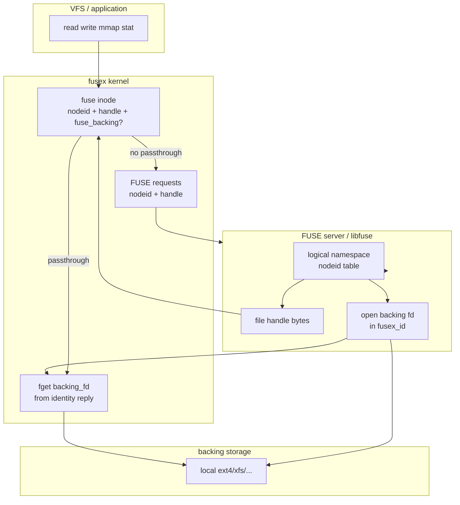

# FUSEX passthrough design (general)

Design for how passthrough fits into fusex: identity delivery, `fusex_id`
(file handle **and** optional backing fd), kernel vs server resolution, and
the unified LOOKUPX / READDIRPLUSX model.

Related: [fusex RFC](https://lore.kernel.org/linux-fsdevel/20260429102058.1362965-1-mszeredi@redhat.com/),
[kernel passthrough doc](https://github.com/torvalds/linux/blob/master/Documentation/filesystems/fuse/fuse-passthrough.rst),
`fusex-readdirplus-design.md`.

---

## Problem statement

Classic FUSE passthrough wires the data path at **OPEN** time:

1. Server opens backing file, registers fd via `FUSE_DEV_IOC_BACKING_OPEN`
2. Kernel returns `backing_id`
3. Server replies to `FUSE_OPEN` with `FOPEN_PASSTHROUGH` + `backing_id`
4. Kernel maps `backing_id` → `struct fuse_backing` → `backing_file_*` I/O

This model breaks down for fusex because:

- **No-open** is mandatory for regular files — there is no OPEN handshake
- **LOOKUPX / READDIRPLUSX** deliver identity separately from attrs — both the
file handle and any passthrough association attach to identity, not open
- **`BACKING_OPEN` + `backing_id` is a classic-`/dev/fuse` artifact.** The OPEN
reply is a byte buffer, so the daemon first registers a file with an ioctl and
then cites the integer token. **FUSE io_uring** already delivers completions
with a real file from the daemon (SQE / registered files / fd in the identity
CQE). There is no need for that extra ioctl or idr step: `fusex_id` carries
`backing_fd` on the same LOOKUPX / MKOBJX / READDIRPLUSX completion.
- **Server-resolved backends** have no kernel-visible backing file — the
handle in `fusex_id` still identifies the object on the wire

The general fusex principle:

> **Identity ops** (LOOKUPX, MKOBJX, READDIRPLUSX) establish *what* the object is
> via `fusex_id`: nodeid plus a **file handle**.
> Optionally the same `fusex_id` also names *which already-open backing file the
> kernel should use for I/O* (`backing_fd`).
> **Metadata ops** (STATX, SETSTATX, xattr, …) go to the server by nodeid +
> handle. **Data ops** use kernel passthrough when `fusex_id` carries a backing
> fd; otherwise they stay on the FUSE wire (handle replayed).

**Handle vs backing:** the file handle is a core part of `fusex_id` — the
kernel stores it and replays it on later requests. Passthrough is an
**additional** field: `backing_fd` on the io_uring identity completion. The
kernel takes that file in the same step — no `backing_id`, no `BACKING_OPEN`
on the fusex path.

`backing_id` remains only for classic FUSE + `FUSE_OPEN` (char-dev, no uring).

---


## Architectural layers




Three fields in `fusex_id`:


| Concept          | Owner           | Role                                                                              |
| ---------------- | --------------- | --------------------------------------------------------------------------------- |
| **nodeid**       | Server          | All FUSE RPCs; inode cache key                                                    |
| **File handle**  | Server          | Extra identity bytes; kernel **stores and replays** them on later wire ops        |
| **Backing fd**   | Kernel + server | Optional; `fget` → `struct fuse_backing` → data-path I/O                          |


The handle is just a cookie the server invents (or copies from `name_to_handle_at`) so later STATX / READ / WRITE requests can name the same object without walking the path again. `backing_fd` is a live open file for kernel passthrough. They are independent.

---


## `fusex_id`: handle plus optional backing fd

Identity replies return a `fusex_id`. The handle is part of that identity.
Passthrough is an extra fd on the same object, not a replacement for the
handle and not a `backing_id`.

Sketch (exact layout is an ABI detail of the fusex RFC):

```c
struct fusex_id {
    uint64_t nodeid;
    uint32_t flags;
    int32_t  backing_fd;     /* -1 / unused unless FUSEX_ID_BACKING_FD */
    uint16_t handle_type;    /* server-defined */
    uint16_t handle_bytes;   /* 0 if no handle */
};
/* handle_bytes of handle payload follow when non-zero */

#define FUSEX_ID_HANDLE          (1 << 0)  /* handle payload present */
#define FUSEX_ID_BACKING_FD      (1 << 1)  /* backing_fd is a daemon fd to fget */
```

`fuse_entryx_out` carries this `fusex_id` (plus validity / negative) on every
identity-returning op:

```c
struct fuse_entryx_out {
    struct fusex_id id;
    uint64_t entry_valid;
    uint32_t entry_valid_nsec;
    uint32_t flags;          /* e.g. FUSE_ENTRYX_NEGATIVE */
};
```

Typical combinations:

| `fusex_id` contents                    | Kernel stores handle | Kernel passthrough |
| -------------------------------------- | -------------------- | ------------------ |
| nodeid only                            | no                   | no                 |
| nodeid + handle                        | yes, replay on wire  | no                 |
| nodeid + handle + `backing_fd`         | yes                  | yes                |
| nodeid + `backing_fd` (no handle)      | no                   | yes (allowed, weaker for replay) |

The last row is possible but not the intended fusex shape: servers should still
send a handle so metadata ops and restart/NFS-style identity work. Passthrough
does not remove the handle.

### File handle (identity cookie)

Opaque bytes the server puts in `fusex_id`. The kernel copies them onto the
inode and includes them on later FUSE requests (`fusex_inode_request()`). A
local-fs daemon typically fills them with `name_to_handle_at()`; a remote
daemon can use an object id, generation, shard key, or anything else it can
round-trip. The kernel does not interpret the bytes.

The same bytes are useful in the daemon for reopen-after-close, NFS export,
and restart (`open_by_handle_at` when they came from `name_to_handle_at`).

### `backing_fd` (addition — passthrough, because of io_uring)

Classic FUSE cannot put a live `struct file` in the OPEN out-payload, so it
splits registration (`FUSE_DEV_IOC_BACKING_OPEN` → `backing_id`) from the
OPEN reply that cites the id.

Fusex identity is expected to complete over **FUSE io_uring**. That path can
hand the kernel a daemon file in the completion itself, so the two-step ioctl
is redundant:

1. Daemon has the backing file open (or a registered-ring fd).
2. LOOKUPX / MKOBJX / READDIRPLUSX CQE includes `fusex_id.backing_fd`.
3. Kernel takes the file (`fget` / ring-registered file) → `fuse_backing` on
   the inode — **one step, no idr.**

Privilege is the same as today’s `BACKING_OPEN` (`CAP_SYS_ADMIN` or equivalent),
still without the ioctl. Sketch:

```text
lookupx reply:
  fusex_id.nodeid + handle_bytes / handle_type
  fusex_id.flags  = FUSEX_ID_HANDLE | FUSEX_ID_BACKING_FD
  fusex_id.backing_fd = <daemon fd>
kernel:
  store handle for wire replay
  fget(backing_fd) → fuse_backing → fuse_inode
```

`CAP_SYS_ADMIN` (or the same privilege `BACKING_OPEN` uses today) still applies
to taking the file for VFS I/O. Creds, stack-depth, and `ops_mask` are captured
at this `fget`, not via a prior ioctl.

Later identity replies for the **same** inode need not repeat `backing_fd` if
`fuse_inode->fb` is already set. The server may send a new fd to replace the
backing association. There is no `backing_id` to cite on subsequent records.

The handle field is independent: it is sent whether or not `backing_fd` is
present.

---


## Entryx flags: identity and passthrough modes

```c
#define FUSE_ENTRYX_NEGATIVE           (1 << 0)
```

Handle kind and passthrough are on **`fusex_id.flags`**.

### Mode A: kernel passthrough (`backing_fd`) + handle

**When:** fusex local-fs mode; daemon can open the backing file (typically
under `source=`).

**Server (identity ops):**

- Fill the **handle**
- Open backing file (or reuse a per-inode cached fd / `keep_fd`)
- Put that fd in `fusex_id.backing_fd` with `FUSEX_ID_BACKING_FD`
- Regular files for data-path passthrough; directories may later use the same
  backing fd for readdir passthrough

**Kernel:**

- Store handle for replay
- If `FUSEX_ID_BACKING_FD`: `fget(backing_fd)`
- stack-depth / creds / `ops_mask` at `fget`
- `fuse_inode_uncached_io_start(inode, NULL, fb)`
- Data path: existing `backing_file_read_iter` / write / mmap
- Metadata still via `FUSE_STATX` etc. by nodeid + handle when the server owns
  attrs

**Properties:** no-open compatible; handle remains the identity cookie;
passthrough is `fuse_backing` from the fd; no fusex `backing_id`.

### Mode B: handle only (server-resolved I/O)

**When:** no kernel-held backing file (no local `source=` tree, or semantic
mapping). `fusex_id` still carries a handle.

**Kernel:** store handle; include on downstream FUSE ops; **no** passthrough.
Server may use internal passthrough invisible to the kernel.

### Mode C: nodeid only (metadata-only identity)

**When:** directories, symlinks, or files with neither handle nor passthrough.

- no handle, no `FUSEX_ID_BACKING_FD`
- nodeid + STATX; READ/WRITE by nodeid on the wire

### Mode D: legacy `backing_id` on `FUSE_OPEN` (fuse only)

Keep for classic FUSE + OPEN. fusex does not use `backing_id`. libfuse may
translate OPEN+backing_id for backward compat on non-fusex mounts.

---


## Identity-time passthrough setup (no-open)

```mermaid
sequenceDiagram
    participant K as fusex kernel
    participant S as server
    participant B as backing file

    Note over K,S: LOOKUPX / MKOBJX / READDIRPLUSX entry
    S->>S: fill file handle
    S->>B: open (or reuse cached fd)
    S->>K: fusex_id(nodeid, handle, BACKING_FD, fd)
    K->>K: fget(fd) → fuse_backing
    K->>K: store handle; fuse_inode_backing_set (no FUSE_OPEN)

    Note over K,S: later read()
    K->>K: backing_file_read_iter (no server RPC)

    Note over K,S: later STATX / SETSTATX
    K->>S: request with nodeid + handle
```

Passthrough is an **inode property** established at first identity link, not a
**file** property from OPEN. Multiple opens share one `fuse_inode->fb` refcount
model (existing `fuse_inode_uncached_io_start` with `ff == NULL`). The handle
is an **inode identity** property on the same link.

Open questions (implementation):

- Lazy `backing_file_open` at first read vs at link time (mmap)
- `FUSE_PASSTHROUGH_INO` matching when enabled
- Replacing `fi->fb` when a later identity reply carries a new `backing_fd`
- Dropping backing (identity reply without fd while `fb` is set)
- `ops_mask` next to `backing_fd` vs session default from INIT
- First-seen inode on READDIRPLUSX: one `fget` per new regular file
- How `backing_fd` is represented on the uring CQE (raw fd vs registered-file
  index) vs fixed 128-byte headers + handle tail

---


## READDIRPLUSX as bulk identity + passthrough

READDIRPLUSX is **bulk `fusex_id`** — handle per record, and optionally
`backing_fd` per record:

```c
struct fuse_direntplusx {
    struct fuse_entryx_out entry;  /* fusex_id: handle + optional backing_fd */
    struct fuse_dirent dirent;
};
```


| `fusex_id`                                      | Effect                            |
| ----------------------------------------------- | --------------------------------- |
| nodeid only                                     | cache name→nodeid; STATX on demand |
| handle                                          | store handle; wire I/O / metadata |
| handle + `FUSEX_ID_BACKING_FD`                  | plus kernel data-path passthrough |
| `FUSE_ENTRYX_NEGATIVE`                          | N/A in readdir (lookup only)      |


Kernel `fusex_direntplusx_link` mirrors `fusex_do_lookup` per record — no
`fuse_change_attributes()` inline; attrs via deferred/batched STATX.

Bulk passthrough cost is real: every **new** regular file that should
passthrough needs an `fget`. Mitigations:

- **`keep_fd` / inode cache:** daemon keeps the backing fd; put it in
  `fusex_id` only on first identity of that inode
- **Already linked:** later READDIRPLUSX/LOOKUPX records send the handle
  without repeating `backing_fd` if `fi->fb` is set

This unifies LOOKUPX, MKOBJX, and READDIRPLUSX under one identity (handle) +
optional backing-fd contract.

---


## Deferred STATX and inode state

Split on the wire:

1. **Identity** — `fusex_id` (nodeid + handle + optional `backing_fd`)
2. **Attributes** — STATX (mask-driven)
3. **I/O channel** — `fuse_backing` from `fget(backing_fd)`, or wire READ/WRITE
   with handle replay

Inode lifetime:


| Phase                    | `fi->nodeid` | handle      | attrs           | `fi->fb`                 |
| ------------------------ | ------------ | ----------- | --------------- | ------------------------ |
| After iget, before STATX | set          | maybe set   | unset (`I_NEW`) | maybe set if BACKING_FD  |
| Published inode          | set          | if provided | from STATX      | if passthrough           |
| getattr                  | set          | unchanged   | cached          | unchanged                |


v0 fusex fetches STATX synchronously in `fusex_get_inode()` before unlock.
READDIRPLUSX can defer STATX further; handle store and backing attach happen at
link time independent of attrs.

---


## libfuse / server implementation sketch

### Local passthrough filesystem (`source=` mirror)

```text
lookupx(parent, name):
  nodeid = alloc_or_find_inode(name)
  name_to_handle_at(backing_dirfd, name, &fh, ...)
  if (regular_file && kernel_passthrough) {
    fd = openat(backing_dirfd, name, …)   /* or cached inode fd */
    reply fusex_id(nodeid, fh, BACKING_FD, fd)
  } else {
    reply fusex_id(nodeid, fh)
  }

readdirplusx(dir):
  for each dirent:
    fill dirent + fusex_id as above
    /* handle always; backing_fd on first identity of a passthrough inode */
```

Aligns with existing `libfuse_passthrough` (`fh_encoder`, `keep_fd`) — handle
goes on the identity wire; the backing fd is consumed at identity instead of
`BACKING_OPEN` + OPEN.

The same handle bytes can be used inside the library for **reopen after
close**, NFS export, and daemon restart (`open_by_handle_at` when applicable).

### Handle-only module

```text
lookupx:
  nodeid = server_lookup(...)
  reply fusex_id(nodeid, handle)
  /* optional BACKING_FD if this server also has a local backing fd */

read (wire):
  server resolves handle from the request
```

libfuse helpers:

- `fusex_id_handle(buf, len, type)`
- `fusex_id_backing_fd(fd)` — **add** backing fd, do not drop the handle
- negotiate at INIT `FUSEX_ID_HANDLE` and `FUSEX_ID_BACKING_FD`

### Bridge from legacy FUSE

- libfuse translates LOOKUP → LOOKUPX + STATX toward the kernel
- synthesize a handle from `(nodeid, generation)` when the server has none
- OPEN+backing_id → hidden shim (not on fusex mount type)

---


## Security and resource accounting


| Concern                   | Handle in `fusex_id`     | Mode A (`backing_fd`)          | Mode B (handle only) | legacy OPEN + backing_id |
| ------------------------- | ------------------------ | ------------------------------ | -------------------- | ------------------------ |
| Daemon fds for data       | no                       | yes (per inode, cacheable)     | none                 | yes (per file)           |
| Kernel `struct file` refs | no (bytes only)          | yes, from `fget` on identity   | no                   | yes, from idr            |
| Privilege for setup       | N/A                      | same as `BACKING_OPEN`         | N/A                  | per `BACKING_OPEN`       |
| Stack depth               | N/A                      | check at `fget`                | N/A                  | check at `BACKING_OPEN`  |
| Creds for backing I/O     | N/A                      | stored at `fget`               | N/A                  | per `BACKING_OPEN`       |
| Replay / restart          | handle on later RPCs     | resend `backing_fd` if `fb` gone | handle on later RPCs | fh on OPEN only        |
| Stale association         | server ESTALE / NOTIFY   | new fd or drop `fb`            | server error on I/O  | fd may stay valid        |


Kernel-held backing refs remain privileged. Putting `backing_fd` next to the
handle in `fusex_id` does not change that; it only matches no-open and drops
the idr. Storing handle bytes is not the same privilege class as taking a
backing file.

---


## Negotiation at INIT

```c
#define FUSEX_ID_HANDLE          (1 << 0)  /* fusex_id may carry a file handle */
#define FUSEX_ID_BACKING_FD      (1 << 1)  /* kernel fgets fd from identity reply */
```

Server must not set `FUSEX_ID_BACKING_FD` if the kernel did not negotiate it.
`fget` failure on link → fail the entry (do not silently drop passthrough).
Missing handle when the kernel negotiated `FUSEX_ID_HANDLE` is a server policy
choice (Mode C).

---


## Comparison summary


|                         | OPEN + backing_id | `fusex_id` handle + `backing_fd` | `fusex_id` handle only |
| ----------------------- | ----------------- | -------------------------------- | ---------------------- |
| fusex no-open           | no                | yes                              | yes                    |
| Handle on identity      | no                | **yes**                          | **yes**                |
| READDIRPLUSX bulk       | awkward           | handle + fd on first identity    | handle per entry       |
| Server registration     | per-file ioctl+idr | none (fd on uring CQE)           | none                   |
| Kernel data path        | yes               | yes                              | no                     |
| Server-resolved backing | no                | local backing only               | yes                    |
| Likelihood for fusex    | classic FUSE only | **primary passthrough**          | primary without PT     |


---


## Recommended direction

1. **`fusex_id` always has room for a file handle** — kernel stores and
   replays it. This is identity, not passthrough.
2. **Additionally extend `fusex_id` with `backing_fd` only.** With io_uring
   the identity completion can hand over a file; a separate `BACKING_OPEN`
   ioctl and `backing_id` are unnecessary. Kernel attaches `fuse_backing`
   from that fd.
3. **Attach both at identity link** (LOOKUPX / MKOBJX / READDIRPLUSX) — no
   `FUSE_OPEN`, no fusex `BACKING_OPEN`.
4. **Add READDIRPLUSX** using the same per-entry `fusex_id` (handle + optional
   fd).
5. **libfuse:** put a file handle on every identity reply (`name_to_handle_at`
   is one way to build it); add `backing_fd` when kernel passthrough is wanted.
   Deprecate OPEN-time `backing_id` on fusex mounts.

One envelope: nodeid + handle for *what*; backing fd for *how the kernel does
I/O*.

---


## Open questions

1. Repeat `backing_fd` on every identity reply, or only until `fi->fb` is set?
2. How does `readdir_passthrough` in libfuse relate to READDIRPLUSX vs
   directory `backing_fd`?
3. Invalidation: handle ESTALE / NOTIFY vs dropping / replacing `fi->fb`?
4. `backing_fd` on the uring CQE: process fd vs `IOSQE_FIXED_FILE` index;
   layout vs fixed headers + handle tail?
5. Per-entry `ops_mask` beside `backing_fd` vs INIT session mask only?
6. Coexistence with classic OPEN+backing_id on a non-fusex connection?
7. Must a `BACKING_FD` `fusex_id` always include a handle, or is fd-only
   identity allowed?
8. Does the kernel `close` the daemon’s fd after `fget`, or must the server
   keep it (dup) until it wants to drop passthrough?
